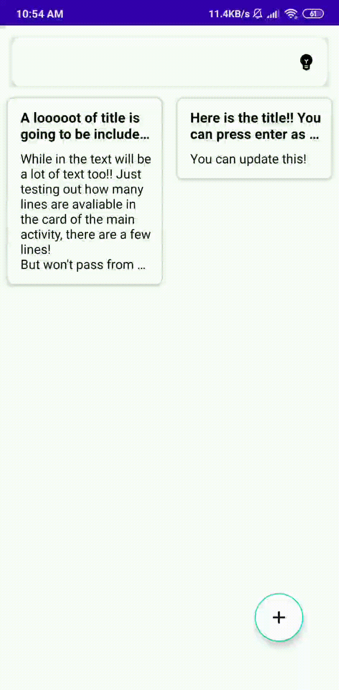
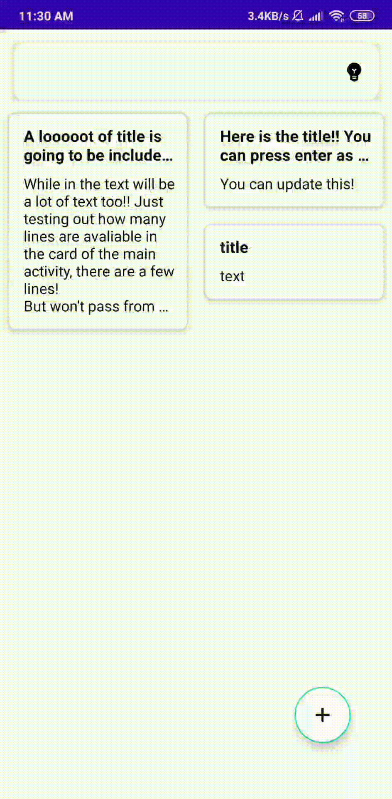
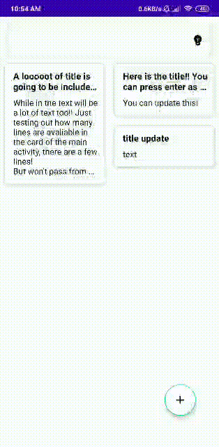
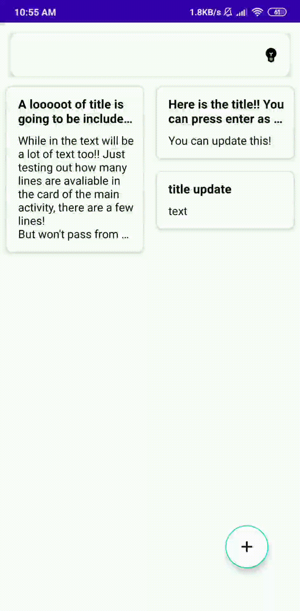
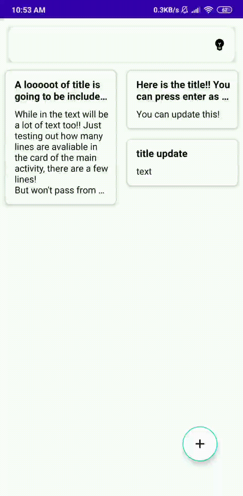

# SimpleToDoNotesApp
SimpleToDoNotes is my first project built by myself using the knowledge that acquired in my last projects.

#### Features 
* Create a note
* Update the note
* Swipe the note to delete
* Delete as many notes you want
* Move the note from its position
* Change the UI to light or dark theme

#### Visualization example

| Create note  | Update a note | Swipe delete  
|---|---|---|
|   |   |   |

| Multiselect delete  | Move note  |  UI |
|---|---|---|
|   |  |  |

#### The app has implemented the next things:
* Room
* Dagger-Hilt
* Coroutines
* DataBinding
* ViewBinding
* LiveData
* Material Design
* MVVM

